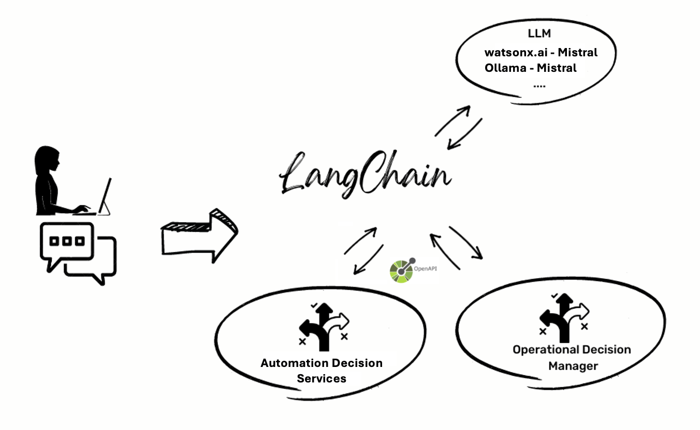
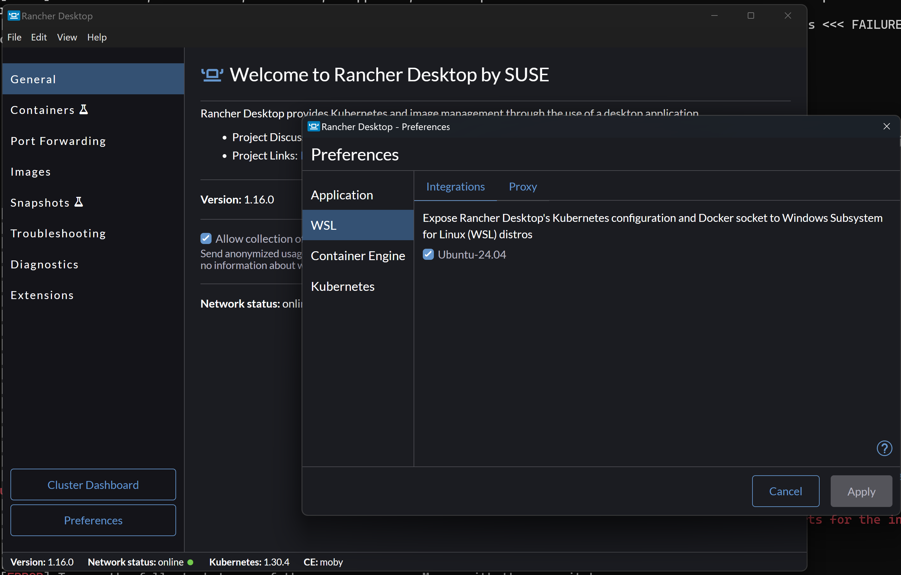
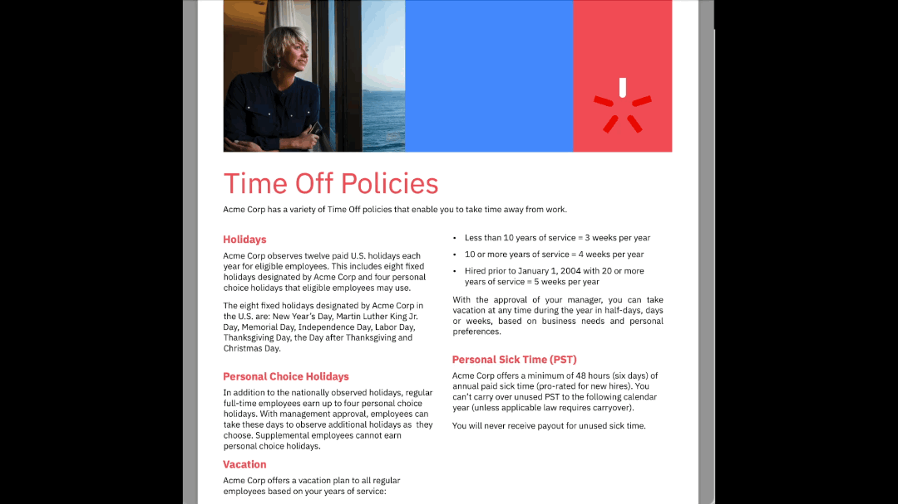

# Rule-based LLMs | AI Chatbot with IBM Decision Services

**Integrate Large Language Models (LLMs) with rule engines for accurate, policy-driven customer support and HR automation.** This open-source project demonstrates a chatbot that combines LLM intelligence with IBM Operational Decision Manager (ODM) and IBM Automation Decision Services (ADS) for reliable, rule-based answers.

---

## Table of Contents

- [Overview](#overview)
- [Features](#features)
- [Architecture](#architecture)
- [Quick Start](#quick-start)
- [Prerequisites](#prerequisites)
- [Setup & Running the Demo](#setup--running-the-demo)
- [Using the Chatbot](#using-the-chatbot)
- [Extending the Demo](#extending-the-demo)
- [FAQ](#faq)
- [Author & Contact](#author--contact)
- [License](#license)

---

## Overview

**Rule-based LLMs** is a demonstration project that shows how to integrate **Large Language Models (LLMs)** with **rule-based decision services**. The solution features a web chatbot powered by an LLM (via Ollama or IBM Watsonx.ai) that can:

- Answer questions using **LLM-only mode** (optionally with RAG over policy documents).
- Answer questions using **Decision Services mode**, where the LLM calls IBM ODM or IBM ADS to get accurate, rule-compliant results.

When a user question can be resolved by an existing Decision Service, the LLM extracts parameters, calls the service, and uses the result to formulate the reply—ensuring **accuracy** where business rules matter (e.g., vacation days, HR policies).

For a deeper dive, see the [presentation](doc/Rule-based%20LLMs%20Presentation.pptx) and [video](doc/Rule-based%20LLMs%20Video.mp4).

---

## Features

- **Dual LLM backends**: Run with [Ollama](https://ollama.com/) (local) or [IBM Watsonx.ai](https://www.ibm.com/watsonx) (cloud).
- **Rule-based decision services**: IBM [Operational Decision Manager (ODM)](https://www.ibm.com/products/operational-decision-manager) and [Automation Decision Services (ADS)](https://www.ibm.com/products/automation-decision-services).
- **HR Service demo**: Pre-packaged example (vacation days, time-off rules) with correct rule execution.
- **Docker-based setup**: Single `docker-compose` flow for ODM, backend, and frontend.
- **LangChain-based backend**: Python rule-agent using LangChain for tool use and LLM orchestration.
- **React + Vite frontend**: Modern chatbot UI (Carbon Design, TypeScript).

---

## Architecture



The chatbot frontend talks to a Python backend (rule-agent). The backend uses an LLM to understand the user query and, in Decision Services mode, invokes IBM ODM or ADS. Results are combined and returned to the user.

**Sub-projects:**

| Component | Description |
|-----------|-------------|
| **rule-agent** | Python backend (LangChain, Flask). Orchestrates LLM and decision service calls. |
| **decision-services** | Sample IBM ODM and IBM ADS decision services (e.g., HR time-off rules). |
| **chatbot-frontend** | React + TypeScript + Vite web app for the chat interface. |

See the READMEs inside each sub-project for details.

---

## Quick Start

1. **Prerequisites**: Docker (e.g. [Rancher Desktop](https://docs.rancherdesktop.io/getting-started/installation)), `git`, and an LLM environment (Ollama or Watsonx—see [Setup](#setting-up-your-environment-for-the-demonstration)).
2. **Clone** the repository and go to the project root.
3. **Configure LLM**: Follow [Running with Ollama (Local)](README_LOCAL.md) or [Running with Watsonx.ai (Cloud)](README_WASTONX.md).
4. **Build and run**:
   ```bash
   docker login
   docker-compose build
   docker-compose up
   ```
5. **Open** [http://localhost:8080](http://localhost:8080) and use the chatbot.

---

## Prerequisites

- **Docker** — [Rancher Desktop on macOS](https://docs.rancherdesktop.io/getting-started/installation) or [Rancher Desktop on Windows](https://docs.rancherdesktop.io/getting-started/installation#windows). Docker Compose is included.
- **Git**
- **LLM setup**: Either [Ollama](https://ollama.com/) (local) or [IBM Watsonx.ai](https://www.ibm.com/watsonx) (cloud).

This demo has been tested on **macOS (M1)** and **Windows 11** with Rancher Desktop.

### Windows with Rancher

1. Enable [WSL (Windows Subsystem for Linux)](https://learn.microsoft.com/en-us/windows/wsl/install).
2. In Rancher Desktop, set the container runtime to use WSL:



---

## Setup & Running the Demo

### Setting up your environment for the demonstration

Choose one LLM option and follow the matching guide:

1. **[Running with Ollama (Local)](README_LOCAL.md)** — LLM runs on your machine.
2. **[Running with Watsonx.ai (Cloud)](README_WASTONX.md)** — Use IBM Watsonx.ai in the cloud.

### Launch the Docker topology

1. **Open a terminal**  
   - Windows: run `wsl` if using WSL.  
   - macOS/Linux: use your usual terminal.

2. **Log in to Docker** (avoids rate limits when pulling images):
   ```bash
   docker login
   ```
   Create a Docker account at [hub.docker.com](https://hub.docker.com/signup) if needed.

3. **Build the demo**
   ```bash
   docker-compose build
   ```

4. **Run the demo**
   ```bash
   docker-compose up
   ```
   This starts IBM ODM (for Developers) and the sample web application.

5. Wait until you see `* Running on all addresses (0.0.0.0)` (or the backend is ready).

6. Use the app at [http://localhost:8080](http://localhost:8080). See [Using the Chatbot](#using-the-chatbot).

**Using an existing ODM instance:** Set these environment variables and adjust `docker-compose.yml` as needed:

```bash
export ODM_SERVER_URL=<ODM Runtime URL>
export ODM_USERNAME=<ODM user, default odmAdmin>
export ODM_PASSWORD=<ODM user password>
```

**Using ADS instead of ODM:** See [README_ADS.md](README_ADS.md).

---

## Using the Chatbot

**URL:** [http://localhost:8080](http://localhost:8080)

**Modes:**

- **LLM-only**: Answers from the LLM, optionally augmented with policy documents (RAG).
- **Decision Services**: Turn on the “Use Decision Services” toggle so the chatbot calls registered Decision Services for rule-based answers.

### Demo scenario: HR Service example

Pre-packaged HR Service answers questions like:

```
John Doe is an Acme Corp employee who was hired on November 1st, 1999. How many vacation days is John Doe entitled to per year?
```

- **LLM-only (with policy doc):** May give an incorrect answer (e.g., “three weeks”) because the LLM misinterprets the policy.
- **Decision Services mode:** The rule engine returns the **correct** result (e.g., 43 days), as defined in the decision service.



### Using the application with your own decision service

The HR example is in the `decision_services` directory. You can use:

- **ODM**: XOM and RuleProject; Ruleapp is deployed to ODM and linked via `data/hrservice/tool_descriptors/hrservice.GetNumberOfVacationDaysPerYearInput.json`.
- **ADS**: Import `decision_services/hr_decision_service/HRDecisionService.zip`, deploy the decision service, and configure the backend for ADS (see [README_ADS.md](README_ADS.md)). Rename `data/hrservice/tool_descriptors/hrservice.GetNumberOfVacationDaysPerYearInput.json.ads` to `data/hrservice/tool_descriptors/hrservice.GetNumberOfVacationDaysPerYearInput.json` so the app uses it.

---

## Extending the Demo

To add a custom use case, follow [README_EXTEND.md](README_EXTEND.md).

---

## FAQ

- **Docker memory issues (e.g. err 137)**  
  Try:
  ```bash
  docker system prune
  ```

- **`docker-compose` not found**  
  Try:
  ```bash
  docker compose up
  ```
  (space instead of hyphen)

---

## Author & Contact

**KuchikiRenji**

- **Email:** [KuchikiRenji@outlook.com](mailto:KuchikiRenji@outlook.com)
- **GitHub:** [github.com/KuchikiRenji](https://github.com/KuchikiRenji)
- **Discord:** `kuchiki_renji`

---

## License

This project is licensed under the [Apache License 2.0](LICENSE).

**Copyright** © IBM Corporation 2024.
